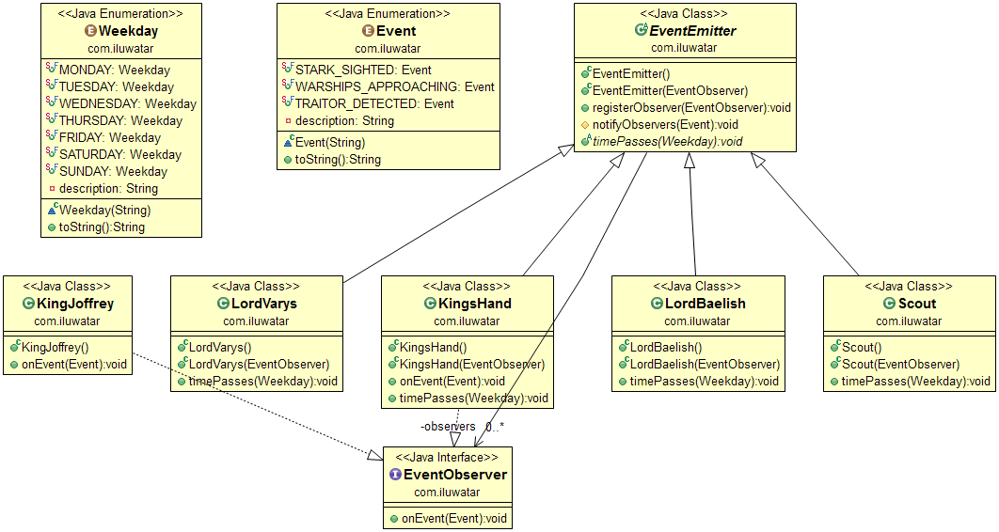

## 意图/目的
当系统中有很多事件源时，客户端想要订阅事件就变得很复杂。客户端必须一个一个的去注册事件源，
如果一个事件源有多种事件，那就更更复杂。事件聚合器可以整合事件源，让他们对客户端表现的就像是只有一个事件源一样，
这样直接订阅事件聚合器就可以订阅聚合器所聚合的所有事件。

## 能力

* 当你有很多事件源的时候，可以将他们整合在一起。

## Credits

* [Martin Fowler - Event Aggregator](http://martinfowler.com/eaaDev/EventAggregator.html)
